## 🛠️ Environment Variables
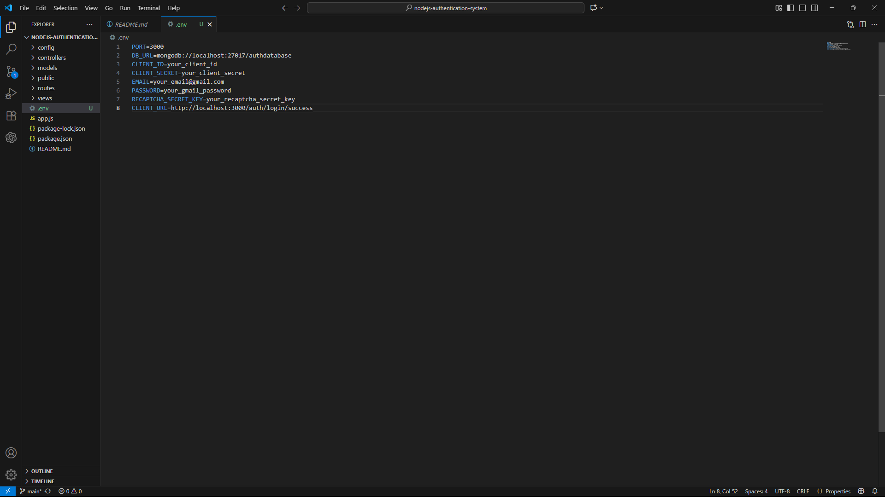
---

## 📂 Folder Structure
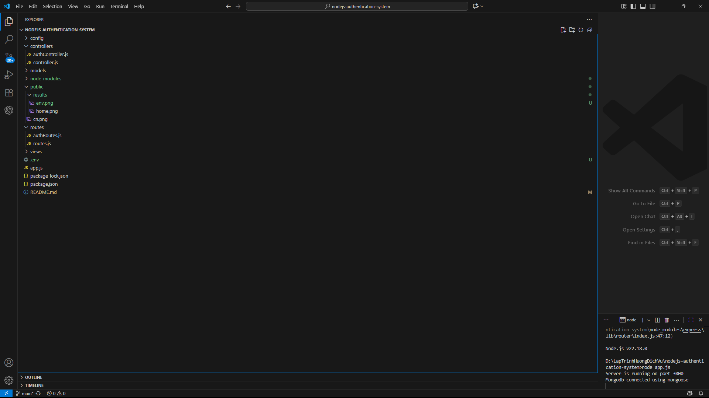

## 🚀 Installation and Setup
Open browser at: http://localhost:3000

## 📸 Postman Test Results
### Home
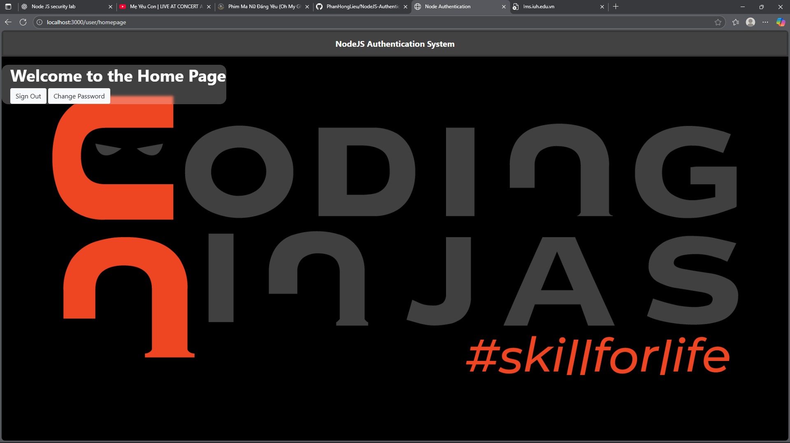
### reCAPTCHA
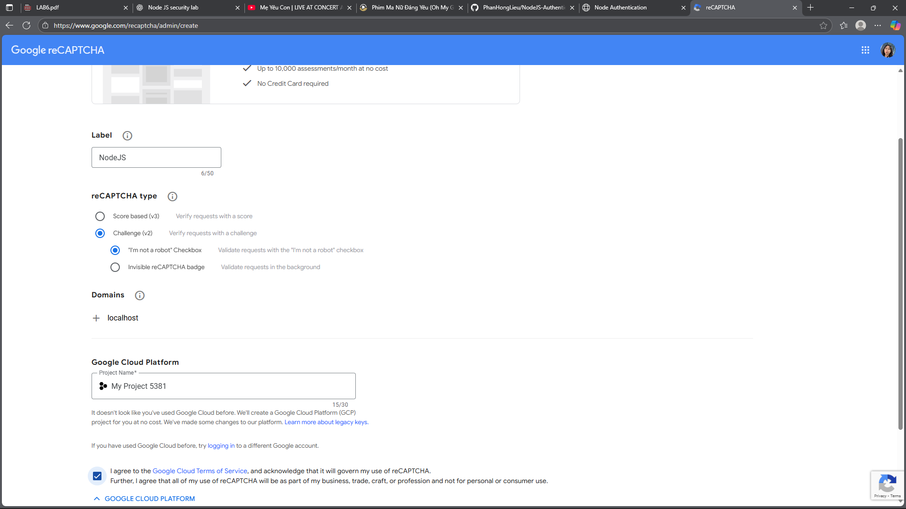
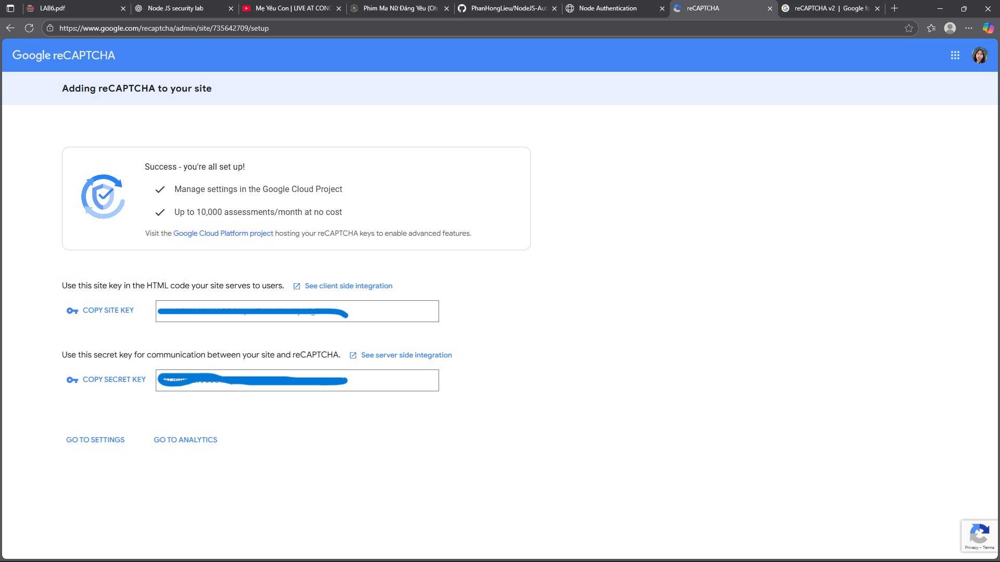
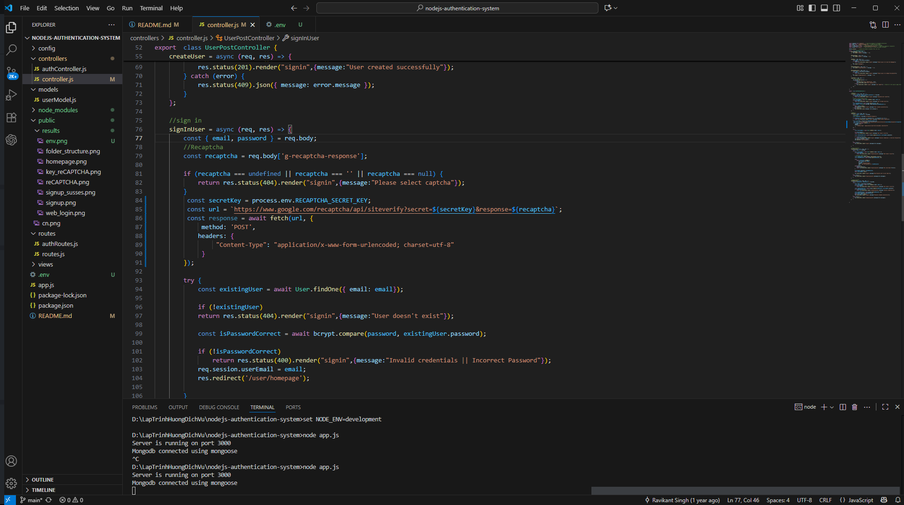
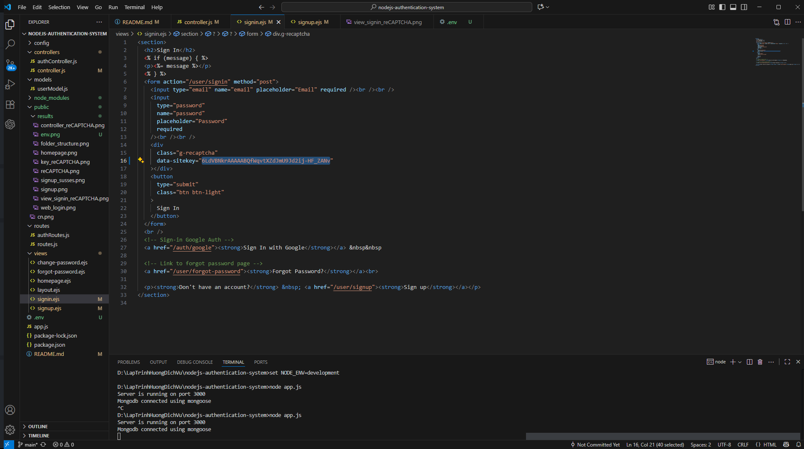
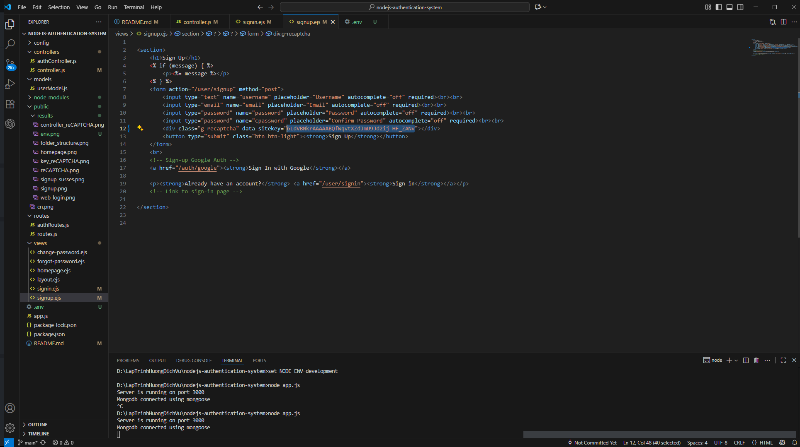
### Register
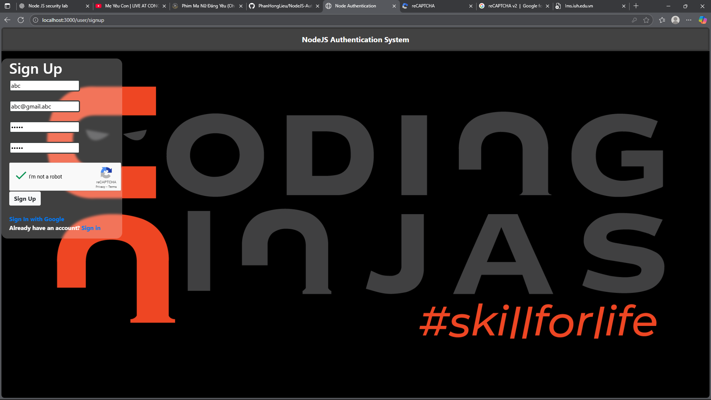

### Login
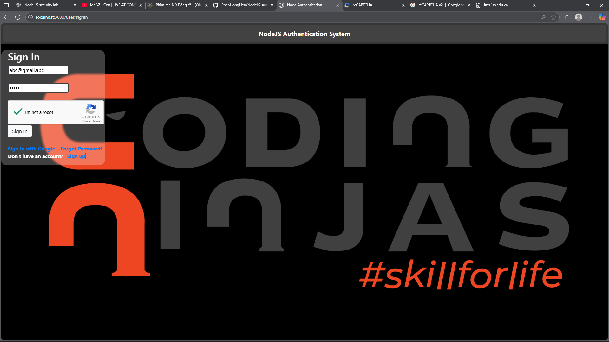

### Logout
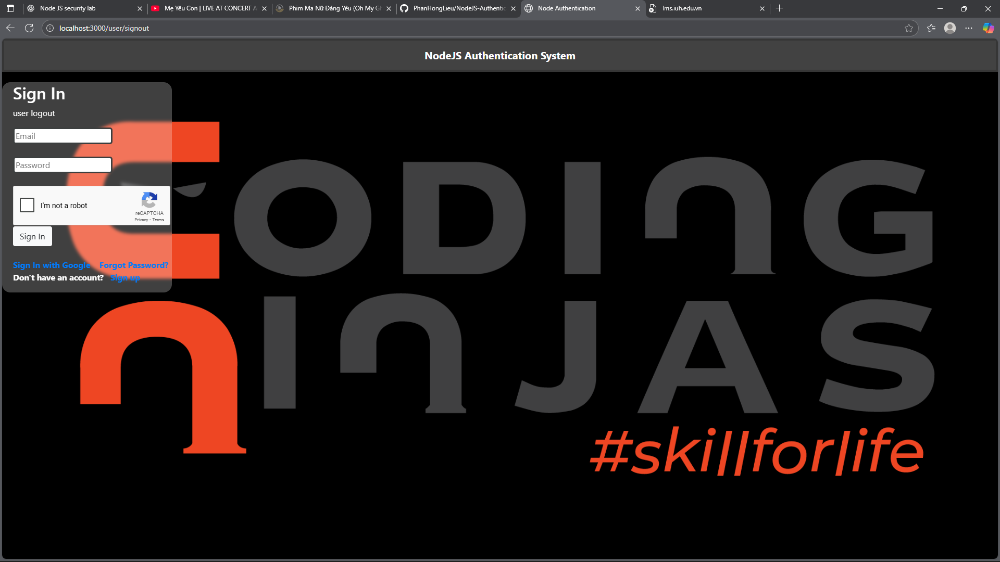

### Forget Password
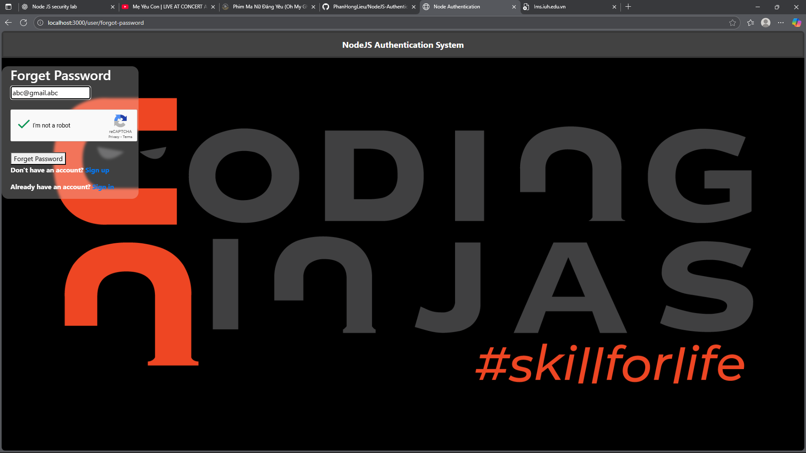

### Change Password
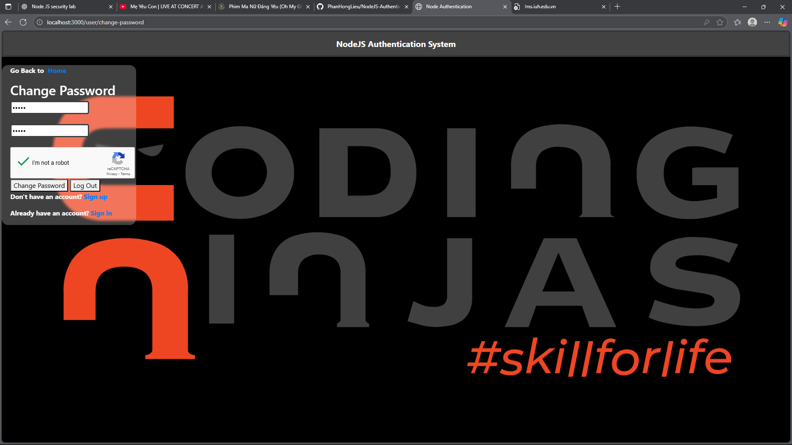
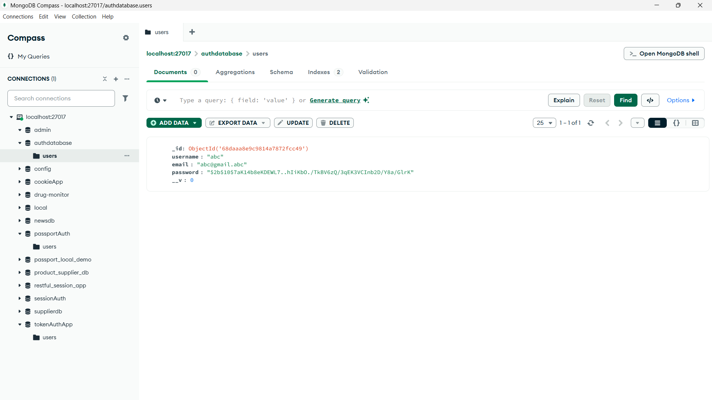

## 📦 Dependencies
express
mongoose
passport
passport-local
express-session
bcrypt
ejs